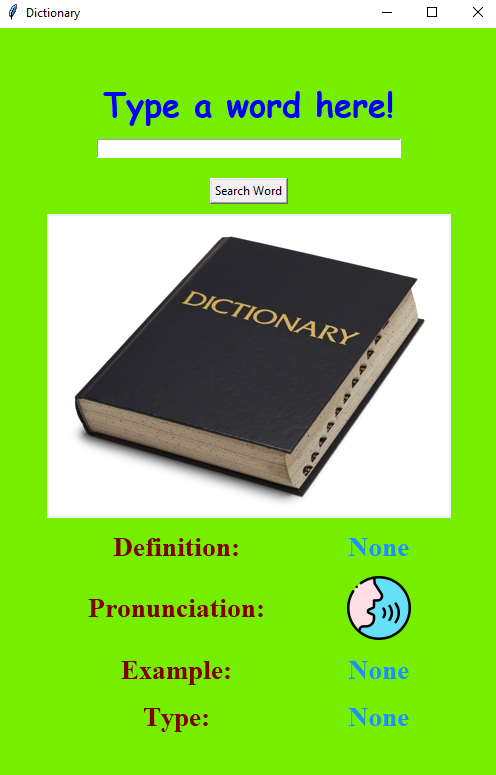

# Dictionary
 A Desktop App that gives the Definition, Pronunciation, Grammar Type and Examples of the word entered. It is a dictionary made with Tkinter.
# Libraries
1. Pillow
```
$ pip install Pillow
```
2. Pyttsx3
```
$ pip install pyttsx3
```
3. Requests
```
$ pip install requests
```
# Usage
- Type a word in the Entry.
- Click "Search Word" Button.
- You will see a Definition, Pronunciation, Grammar Type and Examples of the word entered.
- If you click on the Speak button, you will hear the Pronunciation.
# Preview

